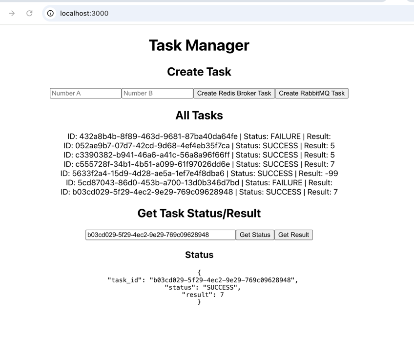
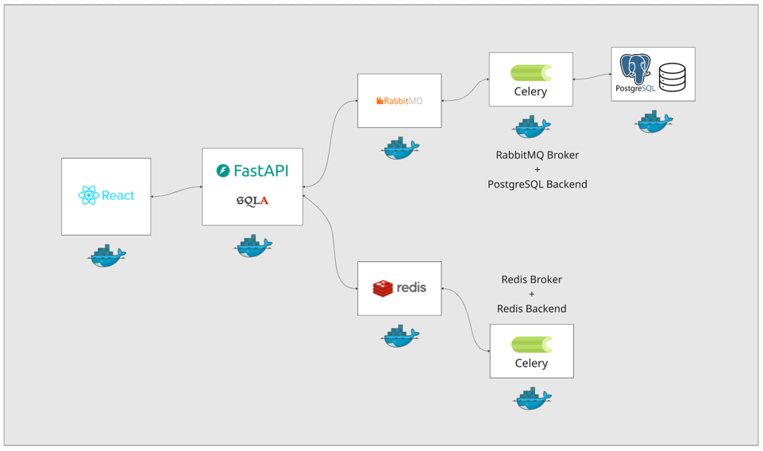

This Entire Repository Contains:
- A React front-end application that allows users to submit long-running tasks and check their status.
- A FastAPI backend that handles incoming requests from the React app and queues tasks in Celery workers.
- Two Celery worker setups:
  - One using Redis as both the message broker and result backend.
  - Another using RabbitMQ as the message broker and PostgreSQL as the result backend.
- Docker Compose configuration to orchestrate all services, including the React app, FastAPI backend, Celery workers, Redis, RabbitMQ, and PostgreSQL.
- Instructions on how to set up and run the entire application stack using Docker:
- 1. Clone the repository.
- 2. Navigate to the project directory.
- 3. Run `docker-compose up --build` to build and start all services.
- 4. Access the React app at `http://localhost:3000`.
- 5. Use the React app to submit tasks and check their status.

Additional Information:
- Redis commander can be accessed at `http://localhost:8081` to monitor Redis data.
- RabbitMQ management interface can be accessed at `http://localhost:15672` with default
- FastAPI documentation is available at `http://localhost:5000/docs`.

Technical Architecture:
